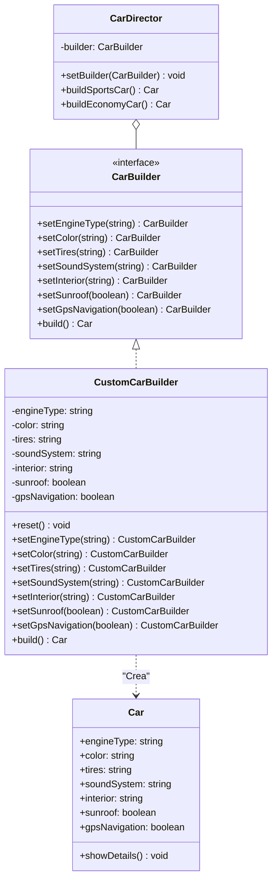

# Diagrama de Clases - Patrón Builder

```mermaid
classDiagram
    class Car {
        +engineType: string
        +color: string
        +tires: string
        +soundSystem: string
        +interior: string
        +sunroof: boolean
        +gpsNavigation: boolean
        +showDetails() void
    }

    class CarBuilder {
        <<interface>>
        +setEngineType(string) CarBuilder
        +setColor(string) CarBuilder
        +setTires(string) CarBuilder
        +setSoundSystem(string) CarBuilder
        +setInterior(string) CarBuilder
        +setSunroof(boolean) CarBuilder
        +setGpsNavigation(boolean) CarBuilder
        +build() Car
    }

    class CustomCarBuilder {
        -engineType: string
        -color: string
        -tires: string
        -soundSystem: string
        -interior: string
        -sunroof: boolean
        -gpsNavigation: boolean
        +reset() void
        +setEngineType(string) CustomCarBuilder
        +setColor(string) CustomCarBuilder
        +setTires(string) CustomCarBuilder
        +setSoundSystem(string) CustomCarBuilder
        +setInterior(string) CustomCarBuilder
        +setSunroof(boolean) CustomCarBuilder
        +setGpsNavigation(boolean) CustomCarBuilder
        +build() Car
    }

    class CarDirector {
        -builder: CarBuilder
        +setBuilder(CarBuilder) void
        +buildSportsCar() Car
        +buildEconomyCar() Car
    }

    CarBuilder <|.. CustomCarBuilder
    CarDirector o-- CarBuilder
    CustomCarBuilder ..> Car : "Crea"
```
