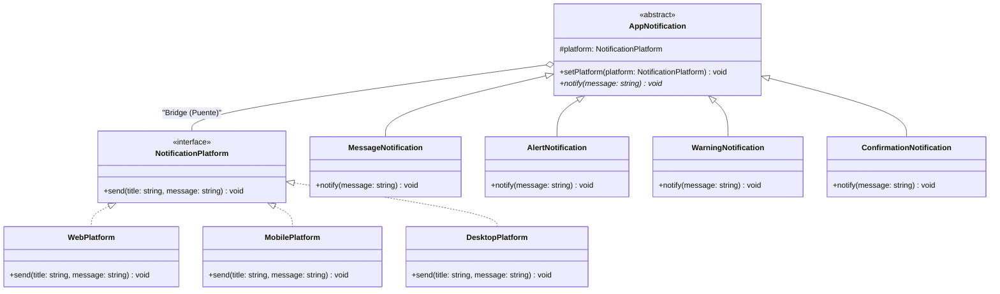

# Diagrama de Clases - Patrón Bridge

```mermaid
classDiagram
    class NotificationPlatform {
        <<interface>>
        +send(title: string, message: string) void
    }

    class WebPlatform {
        +send(title: string, message: string) void
    }

    class MobilePlatform {
        +send(title: string, message: string) void
    }

    class DesktopPlatform {
        +send(title: string, message: string) void
    }

    class AppNotification {
        <<abstract>>
        #platform: NotificationPlatform
        +setPlatform(platform: NotificationPlatform) void
        +notify(message: string)* void
    }

    class MessageNotification {
        +notify(message: string) void
    }

    class AlertNotification {
        +notify(message: string) void
    }

    class WarningNotification {
        +notify(message: string) void
    }

    class ConfirmationNotification {
        +notify(message: string) void
    }

    NotificationPlatform <|.. WebPlatform
    NotificationPlatform <|.. MobilePlatform
    NotificationPlatform <|.. DesktopPlatform

    AppNotification o-- NotificationPlatform : "Bridge (Puente)"

    AppNotification <|-- MessageNotification
    AppNotification <|-- AlertNotification
    AppNotification <|-- WarningNotification
    AppNotification <|-- ConfirmationNotification
```
