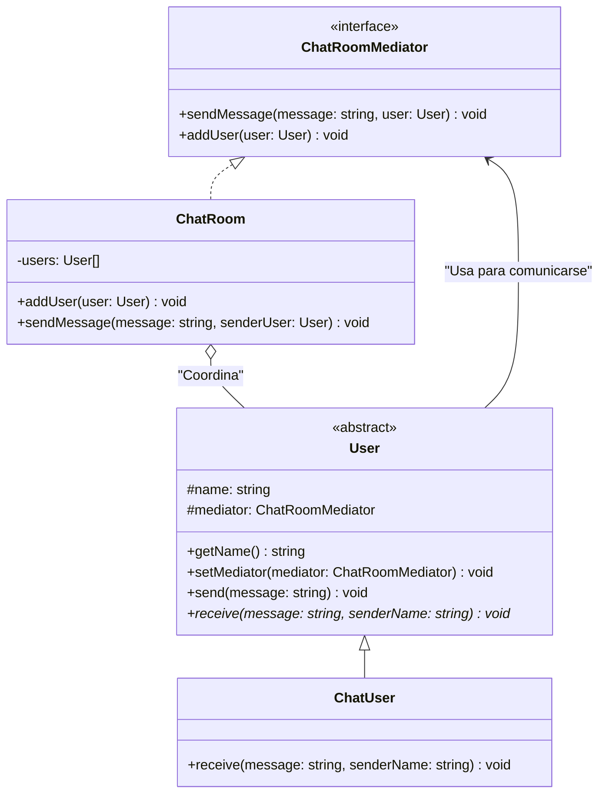

# Diagrama de Clases - Patrón Mediator

```mermaid
classDiagram
    class ChatRoomMediator {
        <<interface>>
        +sendMessage(message: string, user: User) void
        +addUser(user: User) void
    }

    class ChatRoom {
        -users: User[]
        +addUser(user: User) void
        +sendMessage(message: string, senderUser: User) void
    }

    class User {
        <<abstract>>
        #name: string
        #mediator: ChatRoomMediator
        +getName() string
        +setMediator(mediator: ChatRoomMediator) void
        +send(message: string) void
        +receive(message: string, senderName: string)* void
    }

    class ChatUser {
        +receive(message: string, senderName: string) void
    }

    ChatRoomMediator <|.. ChatRoom
    User <|-- ChatUser
    
    User --> ChatRoomMediator : "Usa para comunicarse"
    ChatRoom o-- User : "Coordina"
```
